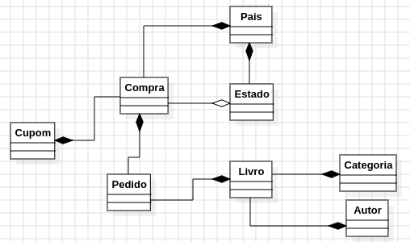

# Projeto desenvolvido no curso Dev Eficiente

## O intuito do projeto é treinar a escrita e design de código. A API simula algumas operações existentes no site da Casa do Código.

A abordagem de desenvolvimento foi guiada pela teória da Carga Cognitiva e pelo CDD (Cognitive Driven Developer),
apresentadas pelo instrutor Alberto durante as aulas de apoio.

### Tecnologia

- **Java**
- **Spring**
- **MySQL**

### Diagrama de classes do projeto

### Funcionalidades implementadas

- Cadastro de um novo Autor
- Cadastro de uma nova Categoria
- Cadastro de um novo Pais
- Cadastro de um novo Estado
- Cadastro de um novo Livro
- Cadastro de um novo Cupom de Desconto
- Criação de um novo pedido de Compra no sistema
- Obter Detalhamento do cadastro de Livro
- Obter Detalhamento de um pedido de Compra
